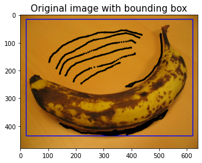
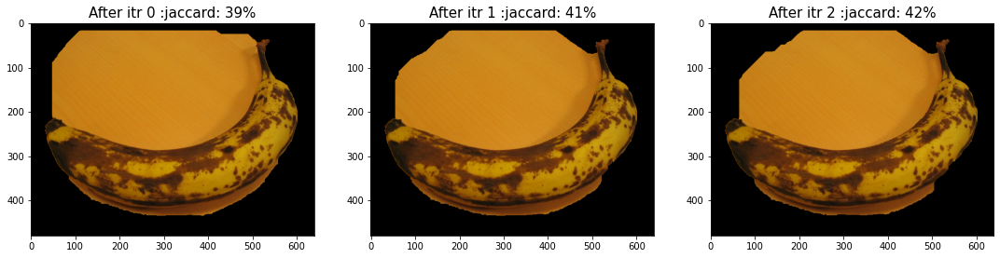
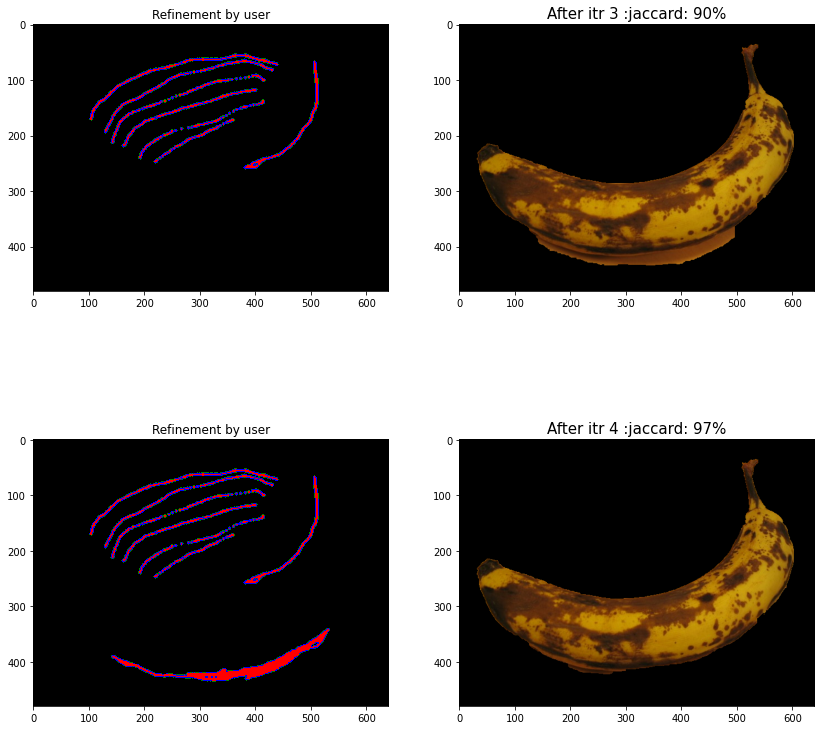
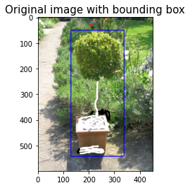
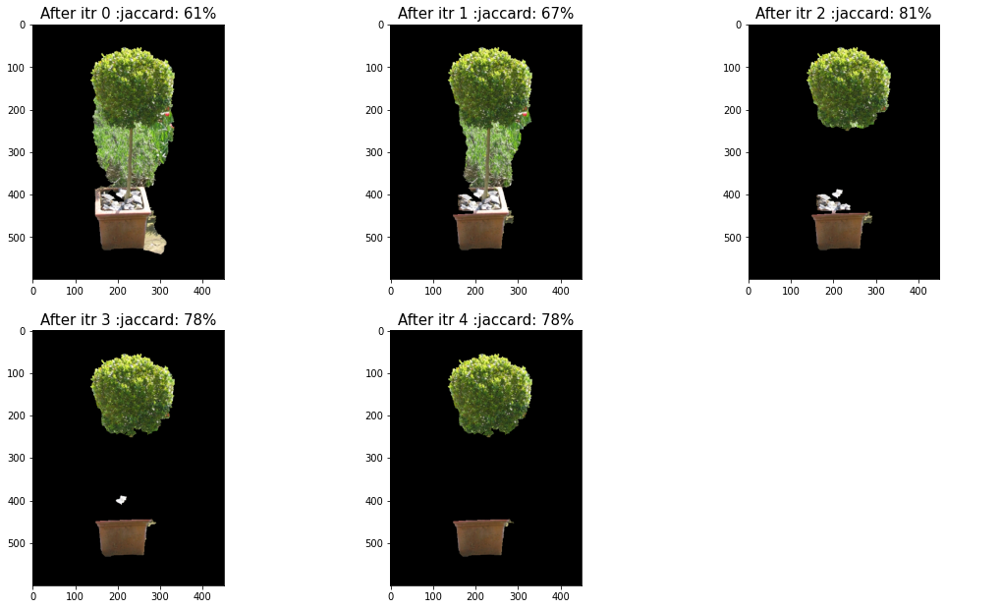
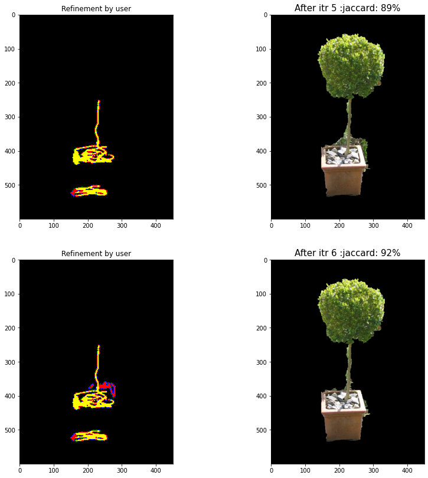
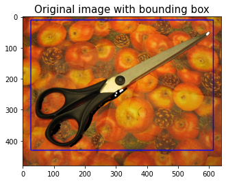
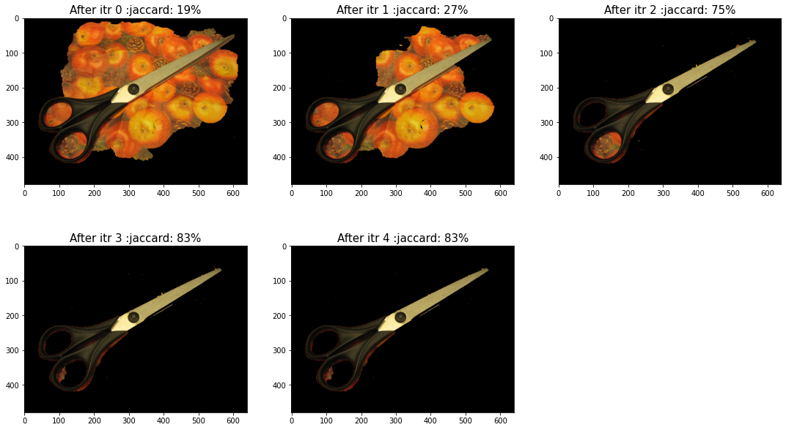
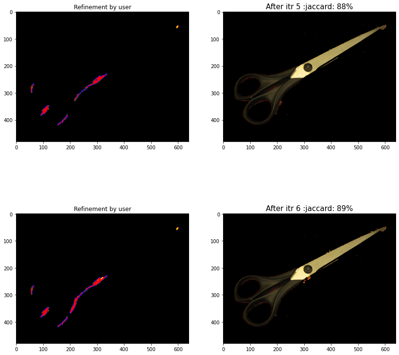

# Implementation of GrabCut algorithm

This repository contains my implementation of the GrabCut Algorithm <a href="#ref1">\[1\]</a>, a markov random field based image segmentation algorithm, which is based on is based on multiple iterations of GraphCut <a href="#ref2">\[2\]</a>, and has a provision for humans to intervene to correct the model's predicted segmentation.

### Parameters involved in the experiments
In the experiments, I manipulate the following parameters and report change in performance across the running times and accuracy:
* Number of iterations
* `Gamma` which is used to model the penalty if two neighboring nodes had different labels
* Number of GMMs allotted per label
* Effect of the tightness of the initial bounding box
* Neighborhood being defined as 4-based connectivity or 8-based connectivity

## Directory structure
The details of my implementation can be found in `01 Report Implementation.pdf`.
The details of experimentation can be found in `02 Report Experiments.pdf`.
**A consolidated report is present at: `FINAL_REPORT.pdf`**

##### IPYNB NOTEBOOKS
* `Assignment3.ipynb`: Has the content corresponding to deliverable 1 (the good and bad examples and ALSO the examples which included user refinement
heatmaps)
* `src/Experiments_<parameter name>.ipynb`: have the images/results used in the experiments which have been used to derive the inferences present in the REPORT
##### JSON and other data
* `ans_data.json`: contains the scores for all images across 10 iterations (with default parameters) and was used to make the table in deliverable 1
* DIRECTORY `ans_images` : contains directories for each image and stores snapshots of the GrabCut pipeline on each image across iterations

## Some results:

### Banana

### Plant

### Scissors

---
<a id="ref1">\[1\]</a> Carsten Rother, Vladimir Kolmogorov, and Andrew Blake. 2004. "GrabCut": interactive foreground extraction using iterated graph cuts. ACM Trans. Graph. 23, 3 (August 2004), 309–314. DOI:https://doi.org/10.1145/1015706.1015720  

<a id="ref2">\[2\]</a> Y. Y. Boykov and M. -. Jolly, "Interactive graph cuts for optimal boundary & region segmentation of objects in N-D images," Proceedings Eighth IEEE International Conference on Computer Vision. ICCV 2001, 2001, pp. 105-112 vol.1, doi: 10.1109/ICCV.2001.937505.